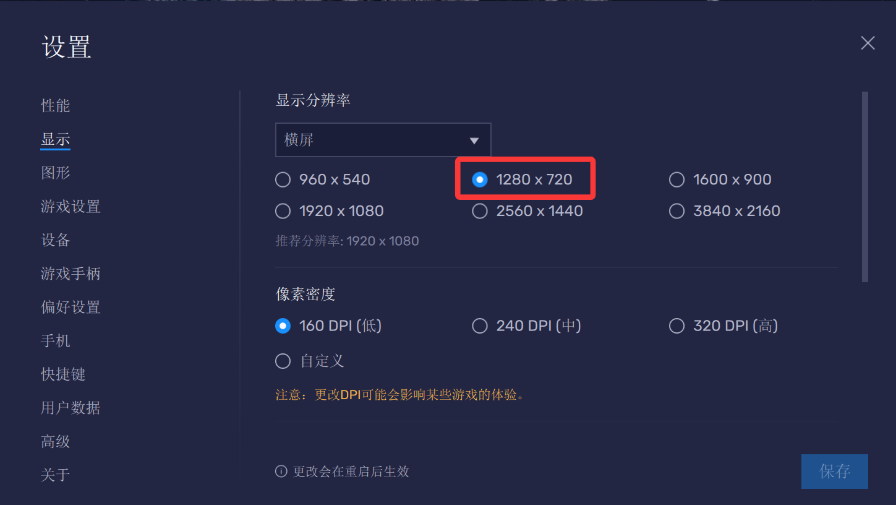
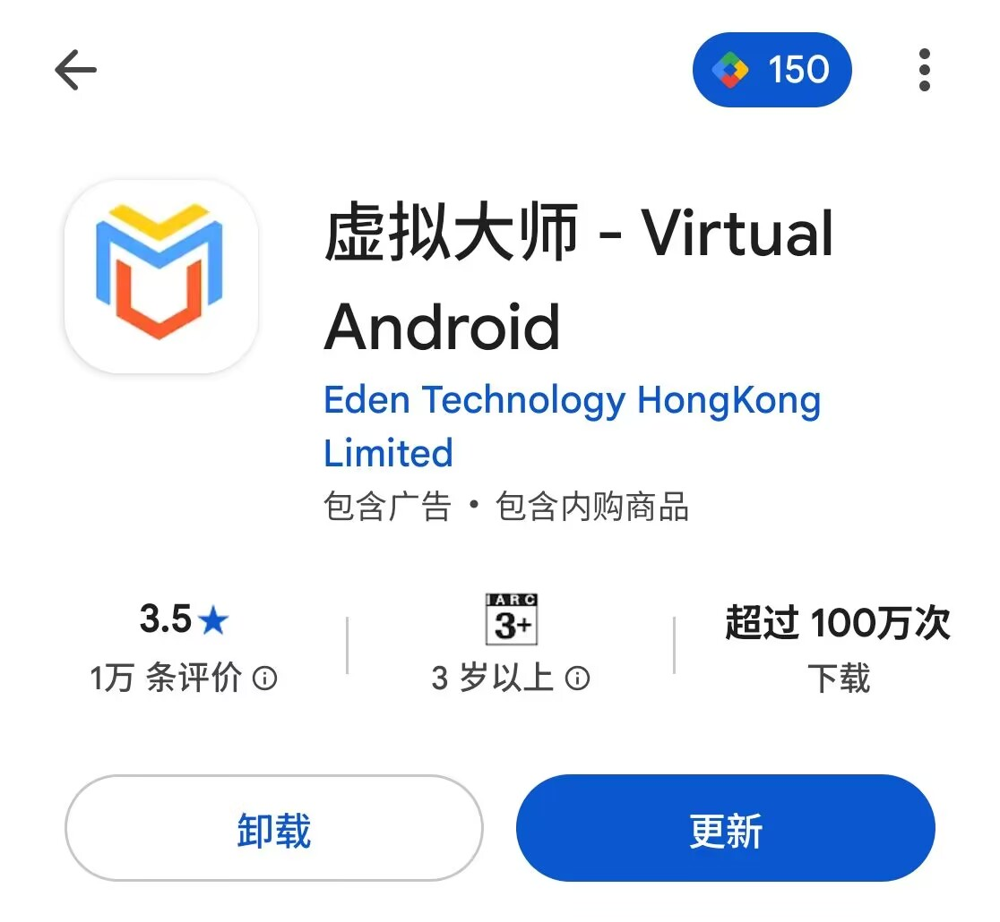
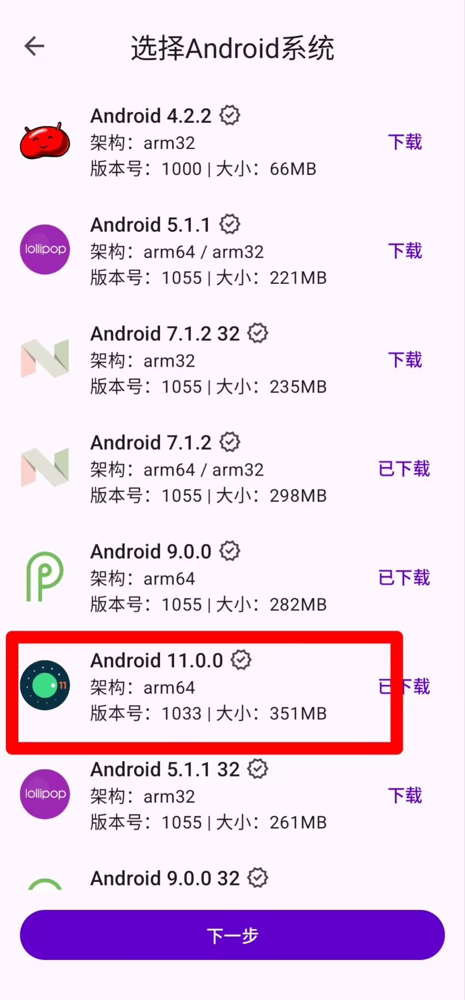
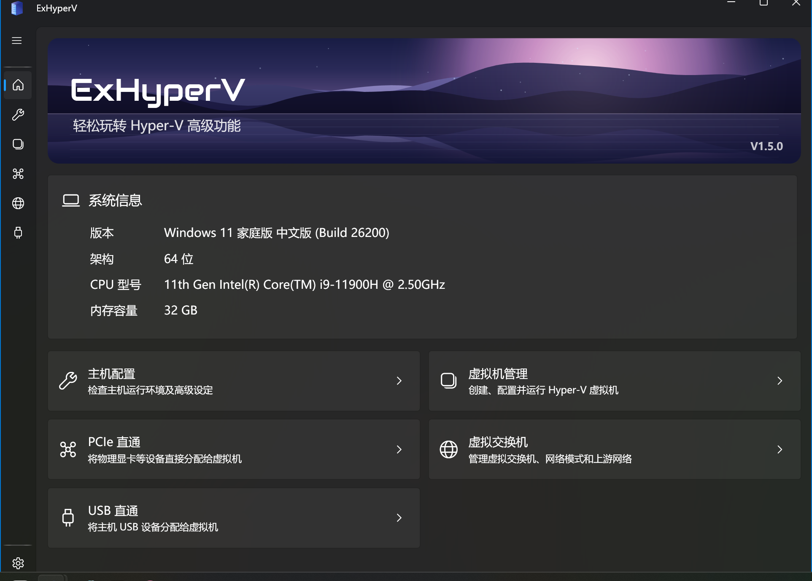

# 模拟器&虚拟机教程


## PC端安卓模拟器
```md
模拟器分辨率设置为1280x720
```


## 安卓端安卓虚拟机

```md
安卓端推荐使用虚拟大师，自行谷歌商店下载
```

```md
系统版本推荐使用安卓11
```

```md
虚拟机Root请参考官方的教程
```
[虚拟大师Root](https://platinmods.com/threads/how-to-root-virtual-master-install-xposed.184421/)

## PC端PC虚拟机
```md
推荐使用Hyperv
一般为专业版系统才能开启
家庭中文版的启用方式可自行百度或者叫AI帮你操作（推荐）
```
```md
管理器推荐EXHyperV
创建虚拟机建议使用二代机
```

