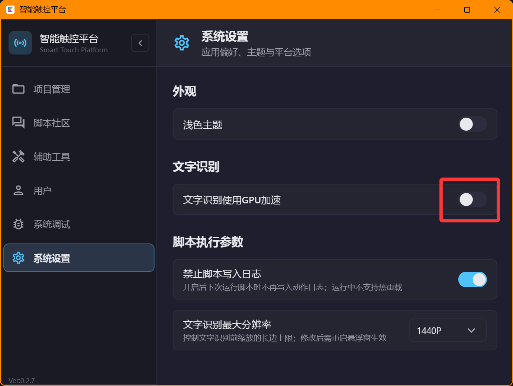
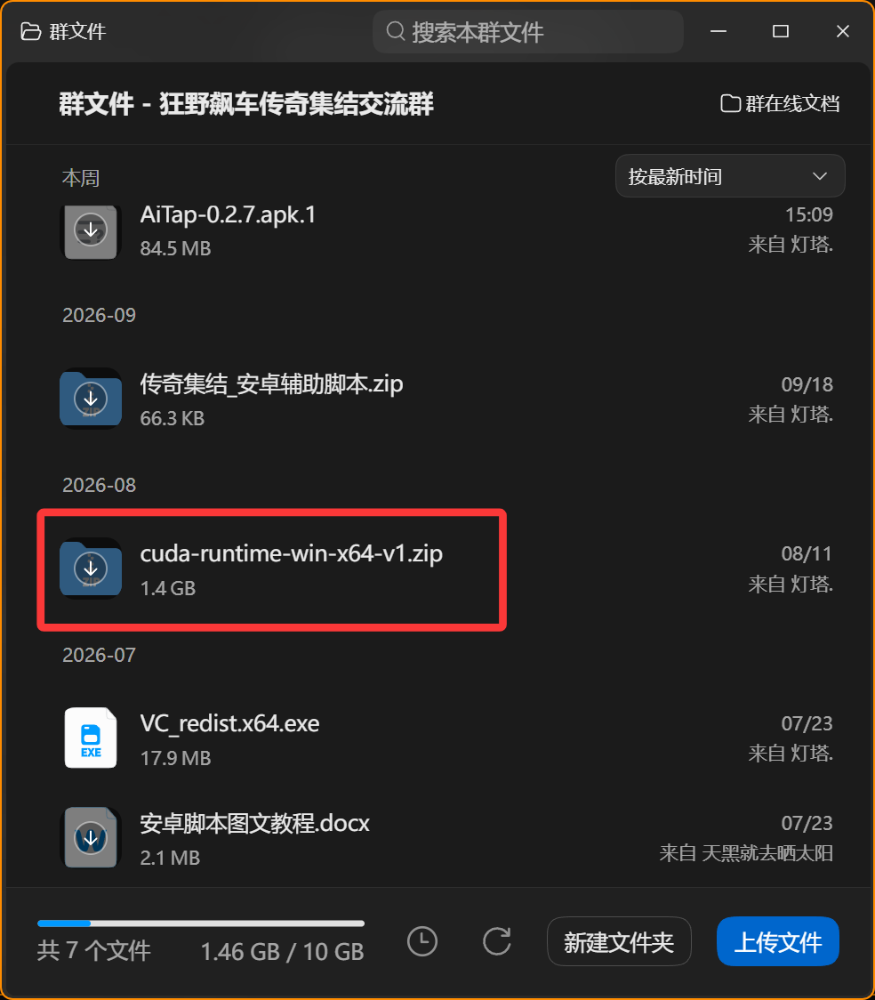
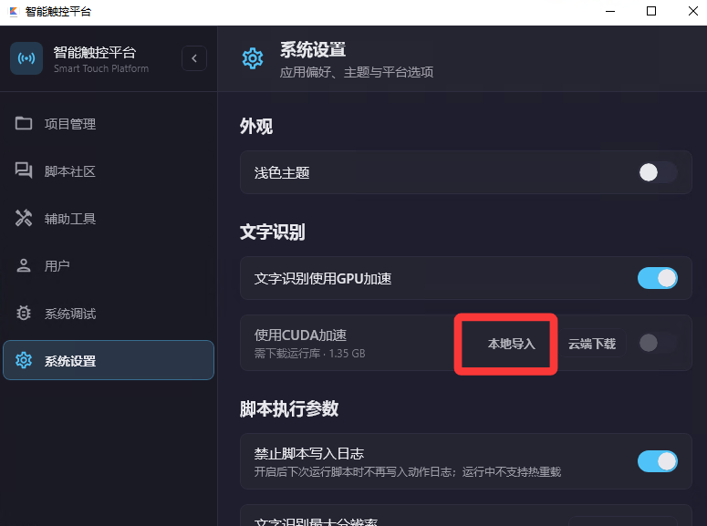
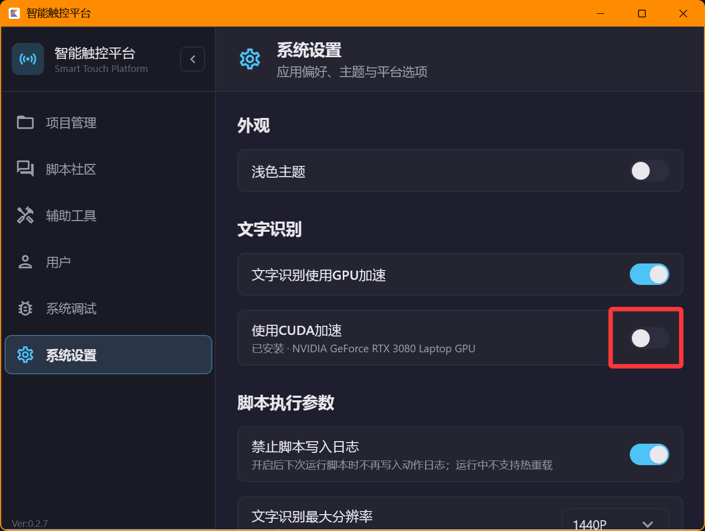

# 附加功能
## GPU加速文字识别
```md
启用GPU代替CPU进行文字识别
一般在Hyperv虚拟机中多开使用，可分配极少的CPU性能配合GPU文字识别，
避免主机卡顿
```

## cuda加速gpu
```md
英伟达显卡在启用GPU代替CPU进行文字识别时可使用cuda加速
但是虚拟机中不可用
cuda文件需要额外下载或者开梯子使用云端下载
```

```md
本地导入后可开启
```

