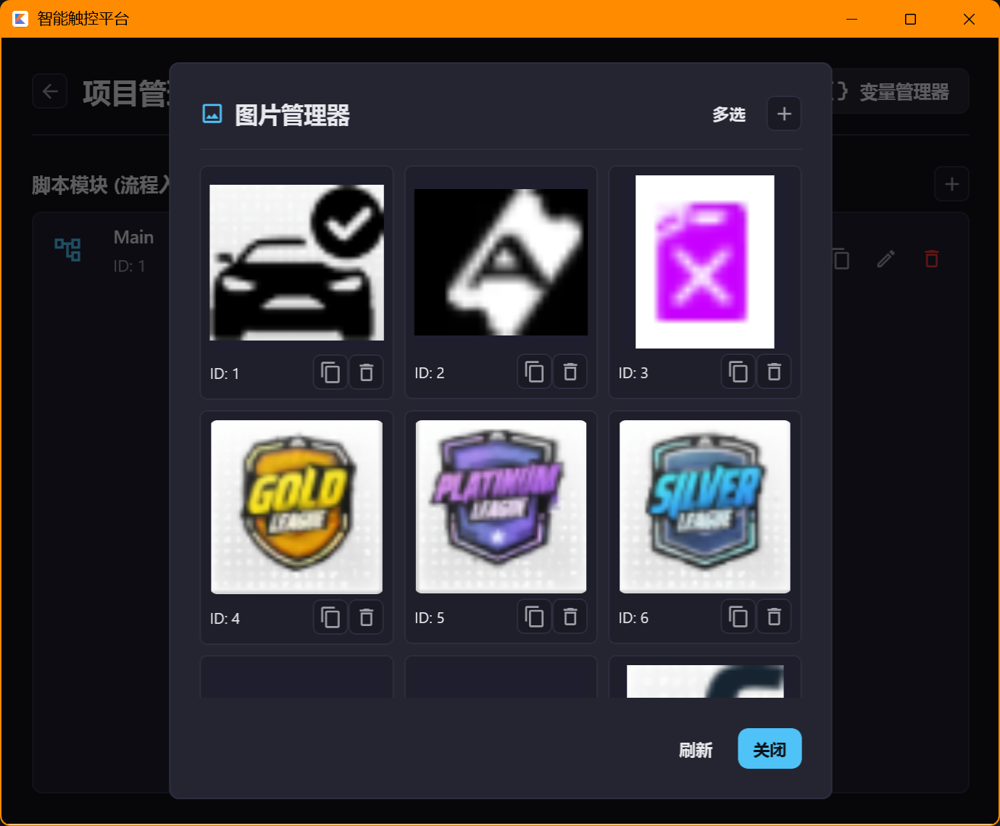
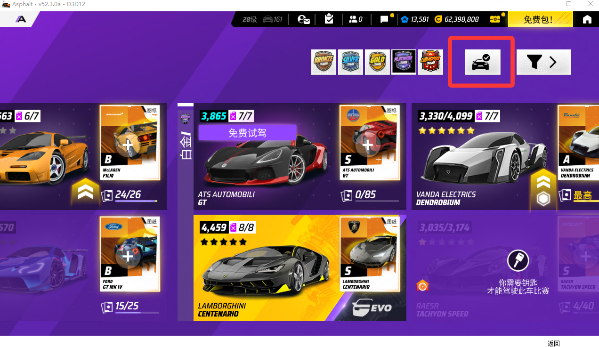
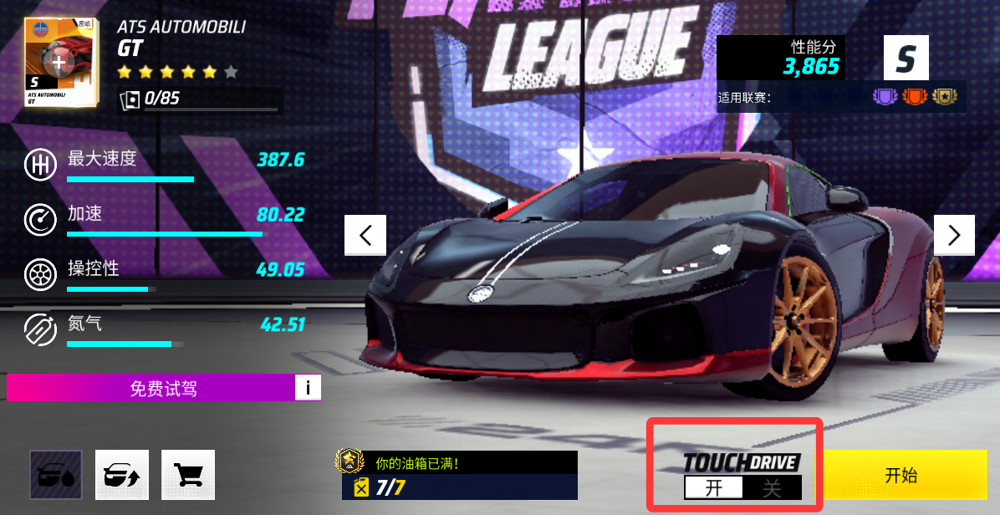
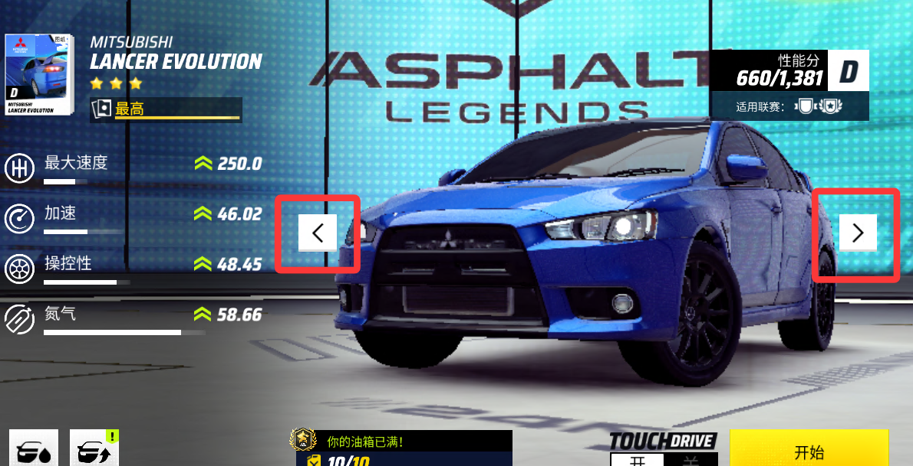

# 辅助脚本使用教程

## 基础功能介绍
```md
辅助脚本用于安卓实体机挂机时的图片截取
由于安卓无root时不能自定义分辨率
所以需要实体机截取并覆盖脚本运行时用到的图片文件
```


## 各个图片对应的位置
```md
拥有车辆按钮
```

```md
每日票券
```

```md
可用车辆图片
```

```md
智能驾驶开、关
```

```md
段位图片
```


```md
上一辆、下一辆
```

```md
关闭
```

```md
每日赛事票券（右上）
```

```md
展厅票券
```

```md
自动驾驶（游戏中）
```


