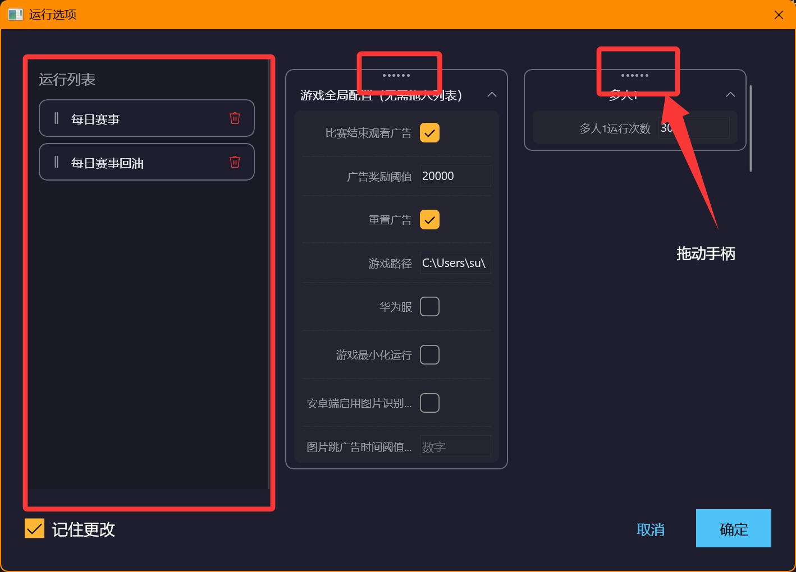
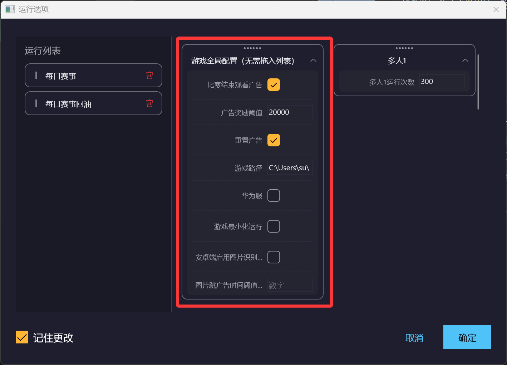
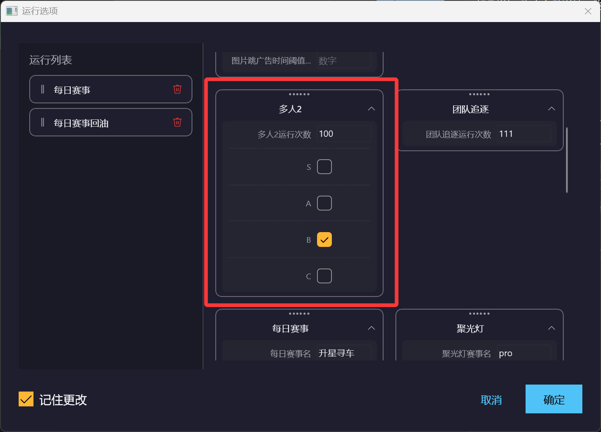
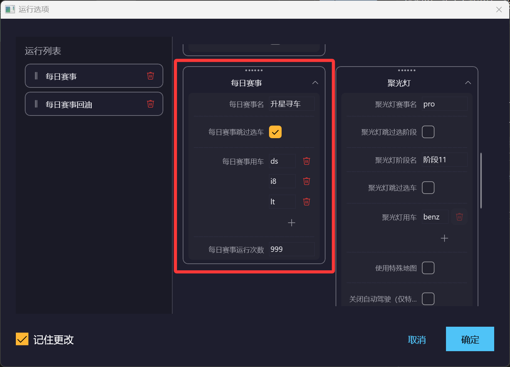
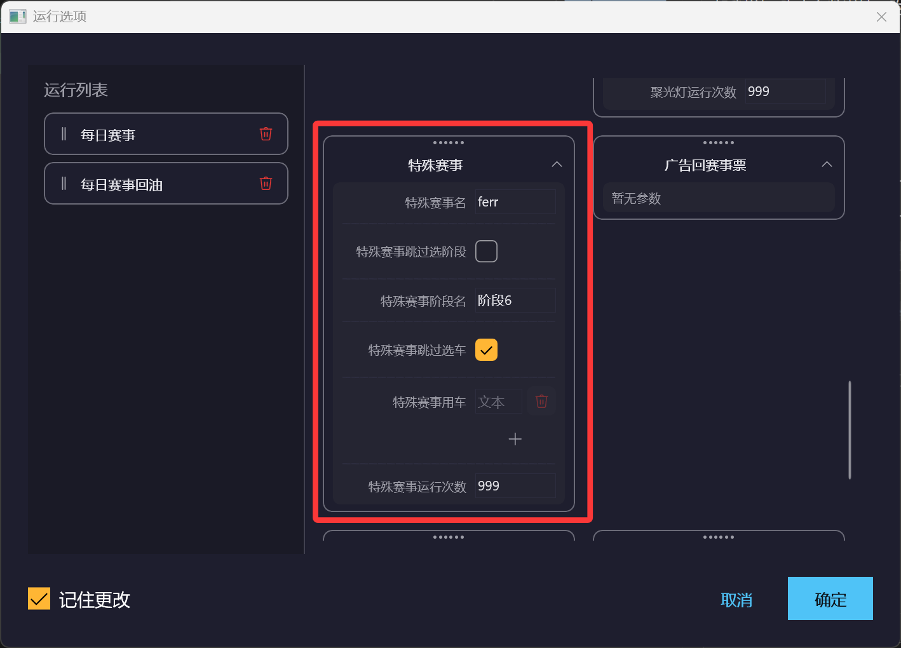
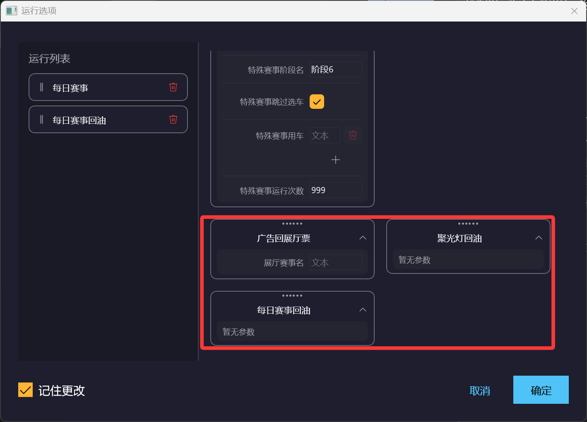

# 脚本参数详情
## 界面说明
```md
左侧为任务视口，右侧为任务卡片
将需要执行的右侧动作卡片拖动到任务视口即可运行
运行时会将任务列表的动作按顺序循环执行
```

```md
左侧为任务视口，右侧为任务卡片
将需要执行的右侧动作卡片拖动到任务视口即可运行
运行时会将任务列表的动作按顺序循环执行
```
## 全局配置
```md
该配置不用拖到任务列表，并且该配置全局生效
```
```md
比赛结束看广告：比赛结束后自动点击观看广告
```
```md
广告奖励阈值：低于该值则跳过观看广告，不填则始终观看广告，推荐值：20000
```
```md
重置广告：开启后自动重置广告奖励次数，并且用于控制广告回油、回票时是否重置广告
安卓端使用该功能需要root权限
```
```md
游戏路径：填入游戏.exe文件或者桌面快捷方式的路径
仅电脑端需要填此项，并且是必填项，安卓端无视
```
```md
华为服：安卓华为国际服端勾选此项
```
```md
游戏最小化运行：仅电脑端生效，勾选后脚本运行期间自动将游戏放入托盘
```
```md
安卓端启动图片识别跳过广告：仅安卓端生效，配合辅助脚本使用
当有广告无法自动跳过时勾选，详情见辅助脚本页
```
```md
图片跳广告时间阈值：勾选图片识别跳过广告后，在该设置的时间后才会启用
推荐值45000
```

## 多人参数配置
```md
运行次数：运行到该次数后自动切换任务列表的下一个模式
每日赛事车辆没油时会自动切换
```
```md
S、A、B、C：用于控制自动选车的段位，仅生效最高档
不勾则用d车
```

## 每日赛事配置
```md
每日赛事名：填入赛事界面中的赛事部分名字，避开特殊符号
```
```md
跳过选车：当点击比赛后只能使用指定车辆时勾选该项，否则填入车名
```
```md
指定用车：填入词组即可，避开字母S、O、I，数字5、0、1以及特殊符号
当识别不精准时将文字识别分辨率设置为1440P
```

## 特殊赛事配置
```md
特殊赛事名：填入赛事界面中的赛事部分名字，避开特殊符号
```
```md
跳过选界面：如果进入赛事直接就是比赛，那么勾选此项
```
```md
阶段名：阶段卡片的名字是啥就填啥，可填阶段名，也可填日期
```
```md
跳过选车：当点击比赛后只能使用指定车辆时勾选该项，否则填入车名
```

## 回票回油
```md
该任务可独立运行，赛事名和用车都是读取的对应的赛事卡片信息
展厅就是ShowRoom
```
